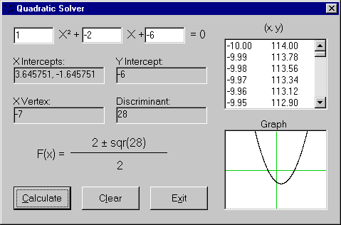



## Quadratic Equation Solver

### Description

This program is a simple Quadratic Equation solver which, aside from finding the x intercepts (whether real or imaginary), it graphs the equation and makes a table of values, and shows the quadratic equation with your values calculated inside. I submitted this program as an example for beginners on the correct use of Object Names, Variable Names, Etc (Based on the Leswinski Naming System). This program of course teaches you how to graph an equation in a picture box, and use a list box. The program uses a Variable Array to store the Y Values of the graph, thereby demonstrating how to utilize a variable array.
 
### More Info
 
To use the program, I assume knowledge of a quadratic equation and how it works.

To use/read the code, I assume a small amount of expirience with Visual Basic.

             |
---                |---
**Submitted On**   |2001-04-16 09:44:28
**By**             |[Merlin Corey](https://github.com/Planet-Source-Code/PSCIndex/blob/master/ByAuthor/merlin-corey.md)
**Level**          |Intermediate
**User Rating**    |4.8 (19 globes from 4 users)
**Compatibility**  |VB 6\.0
**Category**       |[Math/ Dates](https://github.com/Planet-Source-Code/PSCIndex/blob/master/ByCategory/math-dates__1-37.md)
**World**          |[Visual Basic](https://github.com/Planet-Source-Code/PSCIndex/blob/master/ByWorld/visual-basic.md)
**Archive File**   |[Quadratic 203215312001\.zip](https://github.com/Planet-Source-Code/merlin-corey-quadratic-equation-solver__1-23618/archive/master.zip)

